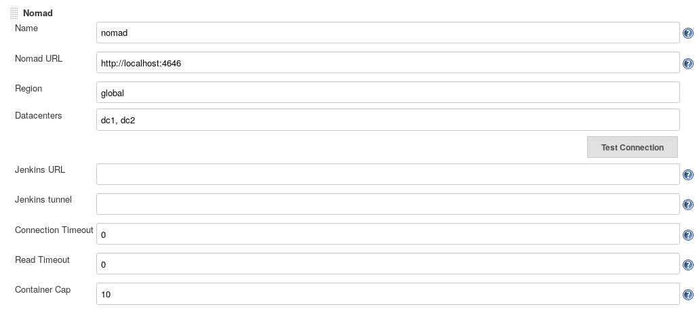

# Nomad Pipeline plugin for Jenkins

<aside class="warning">
**This is a very early release of this plugin!**

There are still plenty of bugs a non-implemented features that you may depend
on!
</aside>

This is a plugin for Jenkins that runs Jenkins job into the Nomad scheduler, and
allow the configuration of the Nomad jobs from Jenkins pipelines.

Sample job:

```groovy

// Guarantee the node will use this template
def label = "job-${UUID.randomUUID().toString()}"

nomadJobTemplate(label: label) {
    node(label) {
        stage("Run shell command") {
            echo "Hello world!"
        }
    }
}
```

# How to use?

## Jenkins master configuration

You first need to install the plugin.

Then, follow the menu *Jenkins* → *Manage Jenkins* → *Configure System*.

In the *Cloud* section, click on *Add a new cloud* → *Nomad* to configure the
Nomad cloud entry.



You will need to set:

* *Name*: this has to be set to `nomad` for now
* *Nomad URL*: the URL to your Nomad cluster. It has to be reachable from the
  Jenkins master
* *Region*: the default Nomad region you want to launch your job in.
  See [Regions and
  Datacenters](https://www.nomadproject.io/docs/internals/architecture.html) in
  the Nomad documentation.
* *Datacenters*: the default Nomad datacenters you want to launch your job in.
  See [Regions and
  Datacenters](https://www.nomadproject.io/docs/internals/architecture.html) in
  the Nomad documentation.

You will then be ready to configure and start a new Jenkins job!


## Jenkins jobs configuration

The plugin creates a new Nomad job for each agent started and stops it after each build.

The plugin expects that the agent launched by Nomad will automatically connect
to the Jenkins master via JNLP (see [Distributed
builds](https://wiki.jenkins.io/display/JENKINS/Distributed+builds)).

For that purpose, the following environment variables are automatically
injected:

* `JENKINS_AGENT_NAME`: the name of the Jenkins agent
* `JENKINS_JNLP_URL`: the URL for Jenkins agent JNLP configuration file
* `JENKINS_SECRET`: the secret key for authentication
* `JENKINS_URL`: the URL to Jenkins web interface

By default if not specified otherwise, the plugin launches the
[jenkins/jnlp-slave](https://hub.docker.com/r/jenkins/jnlp-slave) Docker image.

You can set a more complex configuration, as shown below:

```groovy
// Guarantee the node will use this template
def label = "job-${UUID.randomUUID().toString()}"

nomadJobTemplate(
    label: label,
    taskGroups: [
      taskTemplate(
        name: 'jnlp',
        image: 'jenkins/jnlp-slave:alpine',
        resourcesMemory: 2048,
        resourcesCPU: 1000,
        envVars: [
            envVar(key: 'my-super-var', value: '1234'),
            envVar(key: 'OTHER_VAR', value: 'foobar'),
        ],
    )
  ]
) {
    node(label) {
        stage("Run shell command") {
            echo "Hello world!: ${env.OTHER_VAR}"
        }
    }
}
```

# Features

* Specify the Docker image to run your job in your job definition
* Adjust the resources needed in your job definition
* Configure environment variables for your whole job
* Optionally, automatically download the Jenkins agent from the Jenkins master

Limitations:

* This is a very early version!
* Although it's possible to define multiple tasks, this has not been tested yet
* Although it's possible to define multiple Nomad jobs in the same Jenkins
  pipeline, this has not been tested yet.
* It's currently not possible to configure the agent to receive SSH connection
  from the Jenkins master.


## List of settings

### `nomadJobTemplate`

* `name`: a prefix to start the Nomad job name with. It will automatically be
  completed by a random hash to prevent job name collision.
* `label`: the Jenkins node label to associate the new worker to
* `taskGroups`: a list of `taskTemplate`


### `taskTemplate`

* `name`: the name of the task run by Nomad. This has to be set to `jnlp` for
  now.
* `image`: the [Docker image to run with Nomad](https://www.nomadproject.io/docs/drivers/docker.html#image)
* `resourcesMemory`: the [amount of memory to reserve for the job](https://www.nomadproject.io/docs/job-specification/resources.html#memory-1)
* `resourcesCPU`: the [amount of CPU to reserve for the
  job](https://www.nomadproject.io/docs/job-specification/resources.html#cpu)
* `envVars`: a [list of environment variables to export into the task run by
  Nomad](https://www.nomadproject.io/docs/job-specification/env.html).
  This is a list of `envVar` objects.
* `downloadAgentJar`: default to `false`. If set, download the slave agent from
  the Jenkins master at `http://JENKINS_MASTER/jnlpJars/slave.jar` into
  `/local/slave.jar`, prior to start the Nomad job.

  You can then start the worker using the following command:
  ```
  java -jar /local/slave.jar -jnlpUrl $JENKINS_JNLP_URL -secret $JENKINS_SECRET'
  ```

### `envVar`

* `key`: the name of the environment variable to export into the Nomad job
* `value`: the value of the environment variable. This needs to be a string.


## Migrating from [Nomad Plugin](https://wiki.jenkins.io/display/JENKINS/Nomad+Plugin)

There's another [Jenkins plugin for
Nomad](https://wiki.jenkins.io/display/JENKINS/Nomad+Plugin) which has a very
different approach and doesn't support pipeline jobs defintion.

You can still use the same Docker image as you were using with the other
plugin with a few adjustements:

* The other plugin was downloading an agent `jar` file directly from the Jenkins
  master. This is *not done* automatically by default so you need to set
  `downloadAgentJar` to `true` to download it into `/local/slave.jar`.
* The other plugin was starting the Jenkins agent on behalf of the Docker image.

  You will now need to start this agent yourself by setting the right command
  line in the Nomad job.

```groovy
def label = "job-${UUID.randomUUID().toString()}"
nomadJobTemplate(
    label: label,
    taskGroups: [
      taskTemplate(
        name: 'jnlp',
        image: 'your/image', // Your previous Docker image
        // Download the slave agent from the Jenkins master at
        // http://jenkins-master/jnlpJars/slave.jar
        downloadAgentJar: true,
        command: 'sh',
        args: [
          '-c',
          // Start the Jenkins agent:
          //  * /local/slave.jar is automatically downloaded by Nomad from
          //    the Jenkins master
          //  * The JNLP URL and the Jenkins secret is injected by the Jenkins
          //    Nomad plugin.
          'java -jar /local/slave.jar -jnlpUrl $JENKINS_JNLP_URL -secret $JENKINS_SECRET',
        ],
      )
    ]
) {
  // your build here
}
```


# Contributing

## How to build?

```
mvn package
```


## How to run a test environment?

Easy way:

* [download Nomad](https://releases.hashicorp.com/nomad/) and run `nomad agent
  -dev` on your machine (you need Docker also).
* then run: `mvn hpi:run -Djetty.consoleForceReload=false -Djava.util.logging.config.file=debug-plugin-logging.properties`
* wait for Jenkins to start and connect on http://localhost:8080/jenkins/
* create a new pipeline job with the code from `test-config/test.Jenkinsfile`
* configure Jenkins, add a new Cloud Provider and set the Server URL to http://localhost:4646
